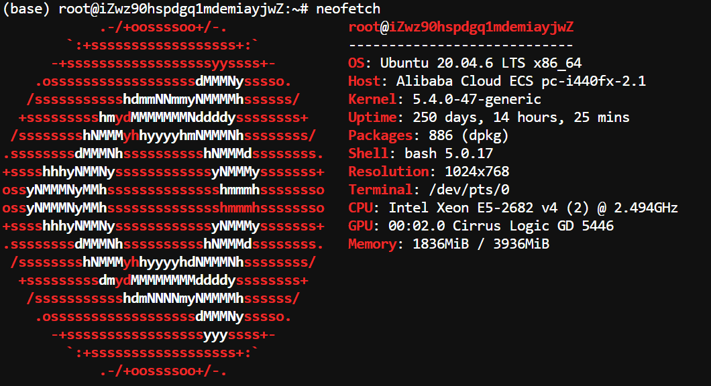
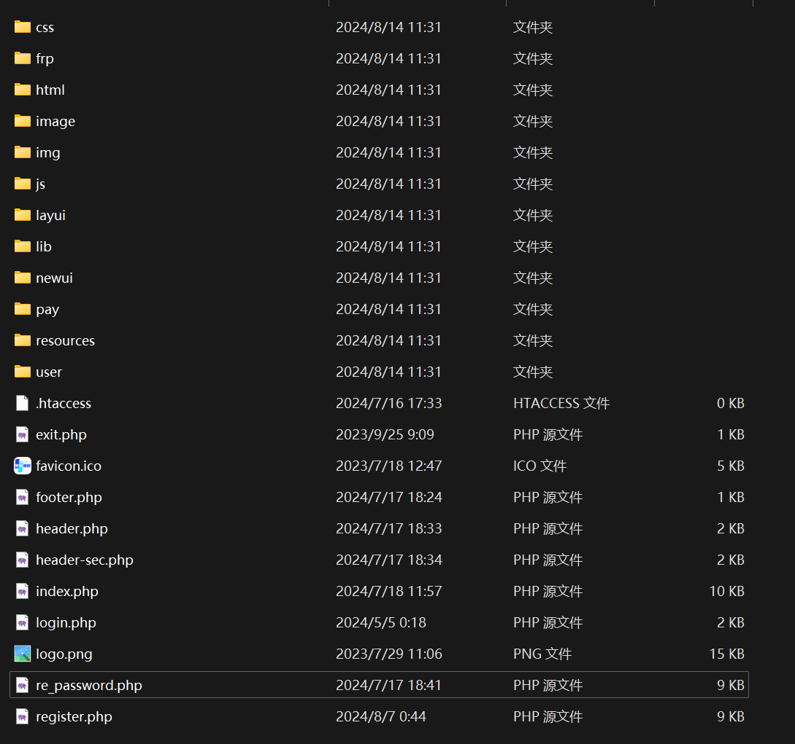

## 何乐映射 HeloFrp 多用户会员制内网穿透映射系统


---

**HeloFrp** 是一款基于 **FRP** 技术的多用户内网映射 Web 商业管理面板，旨在解决传统 FRP 内网映射中的多用户管理和会员制管理问题。通过集成现代化的技术栈，HeloFrp 提供了一个完整的解决方案，支持高效的用户账户管理、内网映射配置、支付系统集成以及跨平台部署，满足了不同用户的需求和业务场景。

### 核心特点

1. **多用户支持**： HeloFrp 使得 FRP 内网映射不仅适用于单个用户，也能够支持多个用户的并发使用。每个用户都有独立的管理面板和访问权限，能够便捷地查看和配置自己的内网映射信息。
2. **会员制系统**： 系统集成了会员制购买方案，用户可以根据不同的会员等级购买相应的内网映射服务。不同等级的会员可以享有不同的服务权限，**例如更高带宽、更长时间的映射或优先的客户支持等（开发者可以自行修改mu插件以适应更多的内容）**。
3. **线上验证功能**： 采用 Helo Furme PHP 用户管理框架进行身份认证，用户在登录时通过线上验证确认身份，以确保只有合法用户才能访问自己的面板和内网映射服务。
4. **支付系统集成**： 为了简化会员购买和付费管理，HeloFrp 使用易支付进行支付操作的集合。用户可以使用多种支付方式（例如支付宝、微信支付等）完成会员购买，确保了支付的便捷性和安全性。
5. **前端界面与用户体验**： 使用 Bootstrap V4 构建前端界面，确保响应式设计，适应不同设备和屏幕尺寸的需求。用户界面简洁、直观，支持用户快速配置内网映射，查看历史记录和实时状态。
6. **FRP 版本支持**： HeloFrp 版本基于 FRP 0.51 进行开发。

#### 一. 历史公开版本详情

| 版本号 | 公开使用日期  |                           更新内容                           |
| :----: | :-----------: | :----------------------------------------------------------: |
| V1.0.1 | 2023年7月11日 | 首个版本 [ ZUI前端 ] <br>支持用户自定义 Token<br>并制作特有启动器 |
| V1.0.2 | 2023年7月12日 | 将创建 Token 放到个人中心<br>优化HeloFrp启动器<br>修复一些小BUG |
| V2.0.1 | 2023年7月30日 |    全新前端，并首次制作Windows GUI启动器<br>优化启动流程     |
| V3.0.1 | 2023年8月21日 | 使用Bootstrap重构全套前端<br>更新Windows GUI启动器样式<br>优化启动流程和安全性<br>修复一些小BUG |
| V3.0.2 | 2024年2月21日 | 优化Web端显示<br>将启动器融入Frpc端，无需外置Frpc核心即可使用<br>优化验证流程<br>修复BUG |
| V4.0.1 | 2024年8月5日  | 重构启动方案，取消密钥，使用支付宝<br>改为后端+服务端验证方案<br>可以使用原版客户端启动 |

#### 二. 开源事项与注意

开源将选择 **Apache 2.0** 开源许可证为 **HeloFrp** 多用户会员制内网穿透映射系统提供开源许可，因为考虑到其对商业使用和修改的宽松支持，下面我将简要描述开源许可证 Apache 2.0 的 **要点和内容**

Apache 2.0 许可证是一种非常流行且宽松的开源许可证，允许用户在遵循一些简单的规定的前提下，自由地使用、修改、分发和销售代码。具体来说，Apache 2.0 具有以下特点：

- **自由使用**：你可以在任何目的下（包括商业用途）使用、复制、修改、合并、发布、分发和再授权。
- **专利许可**：Apache 2.0 提供了一个明确的专利许可，确保贡献者不会对项目的用户提出专利诉讼。这意味着，你在使用该项目时，不会被原作者追诉相关的专利侵权问题。
- **源代码修改**：允许对代码进行修改和再发布。如果你对代码进行了修改并重新发布，必须说明修改的地方。
- **注明作者**：要求在项目的代码或文档中注明原始作者，特别是在你分发代码时。
- **不提供担保**：和大多数开源许可证一样，Apache 2.0 声明对代码的使用没有任何担保。

所以，如果你使用了本程序，请你准售本开源协议，谢谢！

#### 三. 多用户鉴权原理讲解与部署

##### 1.鉴权原理

原版frp使用more_user插件（基于fp-multiuser进行修改，具体内容本作者另外一个开源项目more_user）,more_user插件可以从远程服务器（http链接）读出一个存在用户和用户密码的文件，其文件格式为：

```ini
用户1账号 = 用户1密码
用户2账号 = 用户2密码
用户3账号 = 用户3密码
....
```

这样我们的服务器只需要针对特定权限的用户访问特定的权限链接即可实现用户登录鉴权。

比如我有 服务器A，服务器A是只给VIP用户使用的，那么more_user获取用户的鉴权端口就是后端给出的 vip_user 的返回值（这里就需要开发者考虑如何安全的让服务器获得这个值

【PS : 有个简单的办法就是一个GET中请求一个参数key，key是一个只有开发者自己知道的非公开随机值作为密码，服务器访问这个特定连接即可比较安全的操作和使用】）

软件客户和节点端的请求方式如下图所示


用户控制web面板，web面板鉴权并制作特定权限生成vip_user/all_user的返回值：


| 权限 | 权限描述                              |
| ---- | ------------------------------------- |
| VIP  | 只有VIP用户能使用的服务器             |
| ALL  | 全体用户可以使用的东西【包括VIP权限】 |

##### 2.系统部署

###### 		2.1服务器节点段部署和使用

​	将mu插件（more_user插件），frpc放到同一个目录，使用服务器环境是Ubuntu [如图所示]



先配置Frpc.ini文件

```ini
# frps.ini
[common]
bind_port = 7000

[plugin.multiuser]
addr = 127.0.0.1:7200
path = /handler
ops = Login
```

下面开始配置Linux启动文件：

先执行创建指令

```shell
vim /usr/lib/systemd/system/mu.service
```

然后输入以下内容

**[ 注意，下面的<YOU SEV>请给出web面板服务器地址，<YOU KEY>请给出服务器 KEY，具体Key请参考2.3中的连接件配置，此处可以先设置后将key单独存放，在2.3中的连接件填入即可，此处请注意你的部署目录，确保部署在/home/frp中，否则你将修改你的目录 ]**

这是mu.service

```shell
[Unit]
Description=A frp server plugin to support multiple users for frp
After=network.target syslog.target
Wants=network.target


[Service]
Type=simple
ExecStart=/home/frp/mu -l 127.0.0.1:7200 -m "http:// <YOU SEV> /frp/api_vip.php?key= <YOU KEY>"

[Install]
WantedBy=multi-user.target
```
> **注意：如果你的服务器是作为VIP节点使用，那么就请使用api为**：
>
> *http:// <YOU SEV> /frp/api_vip.php?key= <YOU KEY>*
>
> **否则将作为普通节点使用为：**
>
> *http:// <YOU SEV> /frp/api_u.php?key= <YOU KEY>*

下面是frp.service

```shell
[Unit]
Description=The Frp server
After=network.target remote-fs.target nss-lookup.target

[Service]
Type=simple
ExecStart=/home/frp/frps -c /home/frp/frps.ini

[Install]
WantedBy=multi-user.target
```

然后加载Linux启动服务mu.service和frp.service服务

[注意下面的服务指令，<u>下面只列出mu.service的使用方式，如果你是frps就将mu.service改为frp.service</u>]

```powershell
重载系统服务：systemctl daemon-reload
设置开机启动：systemctl enable mu.service
启动服务：systemctl start mu.service
停止服务：systemctl stop mu.service
重启服务：systemctl reload mu.service
```

现在我们来配置**自动任务**，现在我们需要使用宝塔面板【至于宝塔如何安装和使用本文不再过多赘述】,自动任务如下，下面这个只针对mu.service：


当然你自动任务脚本内容也可以写成这样的形式：

```shell
systemctl stop mu.service
systemctl start mu.service
```

现在你的服务端在环境内被正式部署，但是这里是在上线节点前最后一步，**<u>你需要将服务器的端口和安全组端口的内容开放，注意开放内容为TCP/UDP</u>**。

###### 	2.2 Web面板的部署和使用教程

​	首先从将仓库克隆下来，我们将获得以下文件，并将其导入你网站服务器[注意，***需要使用php7.4并且在php.ini里面修改配置 output_buffering = on***]



现在我们先导入数据库mysql.sql，下图为导入成功后


现在我们来修改几个文件，这些文件都在 ***\lib 文件夹*** 里面

修改conn.php文件


修改DB.php文件


修改好后开始修改我们的邮箱服务器配置（具体配置方法可以去百度上获取)，下面只指出需要修改的地方和内容[config.php]


修改完成后进入组成页面，填入邮箱后发送成功，并在邮箱里面收到一封邮件并注册成功即可


下面是注册成功登录后即可看见测试服务器及前置部署成功


你可以使用修改邮件模板，这里将不再赘述。

**现在你可以使用phpmyadmin进入数据库，下面将为你描述不同表和使用方法：**

​	1.如果你想添加一个节点，请进入server表，然后新建数据，permissions中u是非vip权限使用，1是vip使用，ip为节点ip，port为节点控制端口（默认7000），id不可重复，description为此服务器描述。


​	2.如果你想修改公告，请进入gonggao表直接修改内容即可，其内容支持html文本。

​	3.emailcode是验证码存储地址，paidusers是已支付用户，register是注册用户数据存储。

###### 2.3 Web控制面板与节点服务器连接件设置

​	web的服务器连接件处于Web面板的**/frp目录**中，其文件与描述如下


打开两个文件，并修改 $page_Password 变量，其值为在2.1部分中记录下的KEY

```php
$page_Password = " <YOU KEY> ";
```

> #### 修改好后即可部署成功，如需增加节点请重复 2.1服务器节点段部署和使用

###### 2.4 易支付对接修改

进入\pay\pay\lib目录，修改epay.config.php里面这三个部分即可


至于如何使用易支付，这里将不再赘述（支持对接彩虹易支付以及其所有衍生产品）

#### 四. 致谢

在 **HeloFrp** 项目的开发过程中，我得到了许多人的支持和帮助，这里我要向所有关心和支持这个项目的朋友们表示最诚挚的感谢，你们在 **系统架构设计**、**功能实现**、**调试优化** 等各个方面提供了宝贵的建议，谢谢！

我还要特别感谢那些曾经在 **HeloFrp 商用时期** 支付购买的用户们。你们的支持不仅仅帮助我们保持了项目的持续发展，也为我提供了宝贵的反馈与建议。正是因为你们的支持，我得以进一步优化产品和服务，提升用户体验。每一次看到你们的评价和建议，都充满动力，不断精益求精，力求提供更高质量的服务。

此外，我还要感谢 **B站上的粉丝朋友们**。你们的支持与鼓励是我不断前行的动力。每一次视频发布后，看到大家的评论和反馈，我都深感欣慰和感激。你们的关注和热情，让我更加坚定了将技术与分享结合起来的信念，推动了我不断学习与成长。感谢你们在我忙碌时仍然给予的支持和信任，这对我而言意义重大。

最后，我要特别感谢我的家人、朋友和同学们。你们在我忙于项目开发时，给予了我无微不至的关怀和支持。当项目进展遇到瓶颈时，是你们的理解和鼓励让我不至于放弃；当我焦虑或迷茫时，是你们的陪伴让我重新找回方向。特别是当我长时间沉浸在项目开发的世界中时，正是你们的耐心和包容让我能够心无旁骛，专心投入工作。**你们的支持让我能够无后顾之忧地完成这个项目，这份深厚的情谊，我将永远铭记在心。**

再次感谢所有为 **HeloFrp** 项目贡献力量的朋友们，不论是直接参与开发的伙伴，还是在背后默默支持的每一位。你们的帮助和支持，不仅让我在技术上获得了成长，更让我在为人处事、团队合作等方面受益匪浅。这个项目的成功，离不开你们每一个人的付出。

感谢你们！

